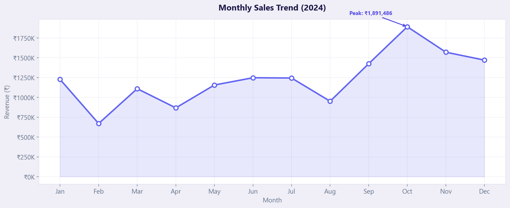

# RetailPulse 📊

> Sales performance analysis of 2,800+ retail transactions across 6 categories — powered by Python, NumPy, Pandas & Matplotlib with an interactive web dashboard.

<!--  -->

## Features

- **Revenue Analysis** — Total revenue, profit, avg order value & margin KPIs
- **Category Performance** — Revenue and profit breakdown across 6 product categories
- **Top 10 Products** — Best sellers ranked by revenue with profit analysis
- **Monthly Sales Trend** — 12-month revenue trend with peak detection
- **Growth Rate** — Month-over-month growth percentage tracking
- **Profit Margin Analysis** — Revenue share donut chart + margin comparison
- **Loss-Making Products** — Identifies products running at a loss
- **Region Performance** — Revenue comparison across North, South, East, West
- **Business Insights** — Auto-generated actionable insights from the data

## Tech Stack

| Layer | Tools |
|-------|-------|
| Data Generation | Python, NumPy |
| Data Analysis | Pandas, NumPy |
| Visualization | Matplotlib |
| Dashboard | HTML, CSS, JavaScript |
| Styling | Custom CSS (Glassmorphism + Animations) |

## Project Structure

```
RetailPulse/
├── analysis/
│   ├── generate_data.py          # synthetic retail data generator
│   ├── analyze_sales.py          # full analysis + chart generation
│   ├── requirements.txt
│   └── output/
│       ├── charts/               # matplotlib charts (7 PNGs)
│       ├── retail_sales_data.csv # generated dataset (2800+ rows)
│       └── analysis_results.json
│
├── dashboard/
│   ├── index.html                # main dashboard page
│   ├── css/style.css             # lavender theme design system
│   ├── js/app.js                 # dynamic data rendering
│   └── data/
│       └── analysis_results.json # data for dashboard
│
└── README.md
```

## How to Run

### 1. Clone the repo

```bash
git clone https://github.com/singhniharikaa/RetailPulse.git
cd RetailPulse
```

### 2. Install Python dependencies

```bash
pip install -r analysis/requirements.txt
```

### 3. Run the analysis

```bash
cd analysis
python analyze_sales.py
```

This generates:
- 7 matplotlib charts in `output/charts/`
- Clean dataset as `output/retail_sales_data.csv`
- Analysis results as JSON for the dashboard

### 4. Open the dashboard

Open `dashboard/index.html` in your browser — the dashboard loads the analysis data automatically.

## Key Findings

| Metric | Value |
|--------|-------|
| Total Revenue | ₹1.48 Cr |
| Total Profit | ₹33.19 L |
| Profit Margin | 22.4% |
| Total Transactions | 2,809 |
| Avg Order Value | ₹5,283 |
| Products Tracked | 50 |

## Charts Generated

| Chart | Description |
|-------|-------------|
| `monthly_sales_trend.png` | Line chart showing revenue over 12 months |
| `category_revenue.png` | Horizontal bar chart of revenue by category |
| `top10_products.png` | Top 10 products ranked by revenue |
| `profit_margins.png` | Donut chart + bar chart of margins |
| `monthly_growth_rate.png` | MoM growth with positive/negative coloring |
| `loss_making_products.png` | Products with negative profit |
| `region_performance.png` | Revenue comparison across 4 regions |

## Skills Demonstrated

- **NumPy** — random data generation with seed, conditional operations, statistical computations
- **Pandas** — groupby aggregations, data cleaning, datetime operations, pivot analysis
- **Matplotlib** — styled charts with custom themes, annotations, formatters, multi-subplot layouts
- **HTML/CSS/JS** — responsive dashboard with animations, dynamic table rendering, intersection observers

## License

MIT

---

*Built by [Niharika Singh](https://github.com/singhniharikaa)*
